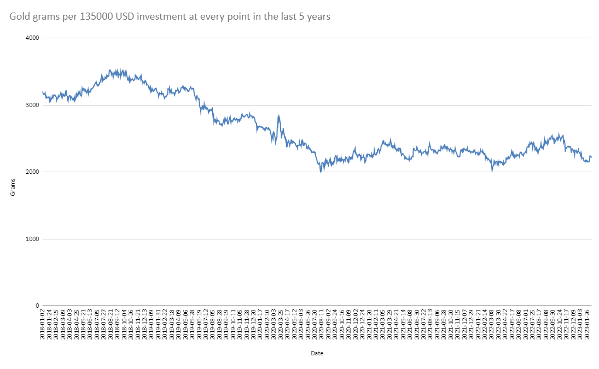

# Golden Insights: Analyzing the Best Time to Invest in Gold on the Polish Market

## Purpose and point of reference
Our project involves acting as an american hedge fund trying to identify the optimal time to invest in gold over the past 5 years. Specifically, we aim to determine the most profitable time to buy and sell gold on the Polish Market using data provided by the Narodowy Bank Polski (National Bank of Poland). Our analysis will leverage this data to identify key market trends and insights that will inform the best investment strategy. 

We're going to assume we have 135,000 USD at any point in time in this interval and we are going to take in consideration the USD/PLN - bid/ask exchange rates provided by the NBP in order to give the most exact timing.

Our hedge fund reports on  U.S. Dollars, so any optimal profits will be calculated upon this currency. Not PLN (Polish Złoty).

The NBP data comes from the following link, which has a variety of API queries: 

```
http://api.nbp.pl/
```

The main two calls we do to this API are the following.

Gold prices on polish currency:

```
https://api.nbp.pl/api/cenyzlota/${startDate}/${endDate}/?format=json
```

Exchange rates USD/PLN:
```
https://api.nbp.pl/api/exchangerates/rates/c/usd/${startDate}/${endDate}/?format=json
```

## Code notes

Given the limitations from the API resolution time, we chunk the queries by years:
```
// Chunks data year by year to avoid request overload
async function retrieveDataYearByYear(type) {
    let allData = [];
    
    for (let year = currentYear - 5; year <= currentYear; year++) {
        const startDate = `${year}-01-01`;
        const endDate = year === currentYear ? `${new Date().toISOString().split("T")[0]}` : `${year}-12-31`;
        
        try {
            const data = await getDataFromAPI(startDate, endDate, type);
            allData = allData.concat(data);
        } catch (error) {
            console.error(error);
        }
    }

    return allData;
}
```
Now we retrieve the data from the API, using an unique identification:

- CZL: Gold prices in polish zloty 
- ER: Exchange rates USD/PLD

```
// Returns data from NBP API, CZL: Gold prices, ER: USD Exchange Rates 
function getDataFromAPI(startDate, endDate, type) {
    let url;
    if (type === "CZL") {
        url = `https://api.nbp.pl/api/cenyzlota/${startDate}/${endDate}/?format=json`;
    } else if (type === "ER") {
        url = `https://api.nbp.pl/api/exchangerates/rates/c/usd/${startDate}/${endDate}/?format=json`;
    }
    return new Promise((resolve, reject) => {
        fetch(url)
        .then(response => {
            if (!response.ok) {
                reject(new Error(`HTTP error! status: ${response.status}`));
            } else {
                return response.json();
            }
        })
        .then(data => {
            if (!data || Object.keys(data).length === 0) {
                resolve([]);
            } else {
                let dataArray;
                if (type === "CZL") {
                    dataArray = Array.from(data);
                } else if (type === "ER") {
                    dataArray = data.rates;
                }
                resolve(dataArray);
            }
        })
        .catch(error => {
            reject(error);
        });
    });
}
```

Once the data gets returned, we wait for both arrays to be retrieved, using promises. The results are combined into one single array.

allDataCZL structure (Gold prices):
```
[
  { data: '2018-01-02', cena: 145.1 },
  { data: '2018-01-03', cena: 145.72 },
  { data: '2018-01-04', cena: 146.36 },
  ...
]
```
allDataER structure (Exchange rates):
```
[
  {
    no: '001/C/NBP/2018',
    effectiveDate: '2018-01-02',
    bid: 3.4506,
    ask: 3.5204
  },
  {
    no: '002/C/NBP/2018',
    effectiveDate: '2018-01-03',
    bid: 3.4232,
    ask: 3.4924
  },
  ...
]
```
We combine the results using the function. 'getCombinedData(allDataCZL, allDataER)'
and the merged arrays look like this:
```
[
  {
    date: '2018-01-02',
    price: 145.1,
    bid: 3.4506,
    ask: 3.5204,
    grams: 3210.413507925569
  },
  {
    date: '2018-01-03',
    price: 145.72,
    bid: 3.4232,
    ask: 3.4924,
    grams: 3171.3697502058744
  },
  ...
]
```

Note that a property called 'grams' is calculated, this means that for every point in time in the last 5 years, we know how many grams of gold we were able to buy, taking in consideration the gold price and exchange rate USD/PLN. 

Now the data is ready to be processed using the function 'processingData(data)', and in order to obtain the optimal dates, the 'findBestProfit(prices)' function comes into place. 

This is where the heart of the problem comes into place, first we sort the merged input array in ascending order by date.

Then we pivot our initial positions (buy dates) to every day until today in the last 5 years (sell date), starting from the latest date, and comparing the profits if we sold our initial investment.

```
profit =  (sortedData[i].grams * sortedData[j].price) / sortedData[j].ask - investmentAmount
```

```
profit =  (grams_bought * gold_price_for_every_next_day_until_today) / dollar_price_in_every_next_day_until_today - investmentAmount
```

If the profit becomes larger than previous one, we assign it as the current better deal, and since this profit is correlated to a buy and sell date, we can return them if it's the highest one. 

Keep in mind the profit is calculated on USD, that why we convert the polish currency obtained buy selling our grams of gold to USD.

This is done because we can have a profit on PLN, but not necessarily on USD. PLN could have fallen dramatically on demand and become a false positive for our investment.

```
// Finds the most profitable dates, best to buy and sell 
function findBestProfit(prices) {
    let sortedData = []
    sortedData = sortDataByDate(prices);
    let maxProfit = 0;
    let bestBuy;
    let bestSell;
    
    for (let i = 0; i < sortedData.length - 1; i++) {
        for (let j = i + 1; j < sortedData.length; j++) {
            const profit =  (sortedData[i].grams * sortedData[j].price) / sortedData[j].ask - investmentAmount
            if (profit > maxProfit) {
                maxProfit = profit;
                bestBuy = i;
                bestSell = j; 
            }
        }
    }
    
    return {
        buy: prices[bestBuy].date,
        sell: prices[bestSell].date,
        usd_Profit: maxProfit
    };

}
```

## Instalation

You can create a docker container with the following commands:

```
docker build -t node-gold_P
```

Check if the image was built:
```
docker images
```

Run the image:
```
docker run node-gold_P
```

## Expected results in the last 5 years

Here's a graphic for the gold price on PLN. As you can see, around august 2018, the amount of grams per invesment were the highest and around 2020 were the lowest. Which means the acquisition by a 135000 USD investment dropped. In other words, this point was the worst to buy. 



Here's a link to a more detailed look:

```
https://docs.google.com/spreadsheets/d/1a6fW1xegSM8oynQIW-xs52KzzxEaLbB5/edit?usp=sharing&ouid=102032123110122250160&rtpof=true&sd=true
```

## Results

On console.log we can see the following results, which matches the expected data:

```
Best time to buy: 2018-08-20
Best time to sell: 2020-08-07
Total profit in USD: 97217.12923589599 for a total investment of: 135000 USD
```

## Conclusions
Investments can be affected by the strength of the currency we exchange to. In our case, if the polish currency plummets, and the price of gold remains almost the same, there's a loss.

Example:

We invest 135000 USD on 2018-01-01 at a golden price = 100 PLN and exchange rate into PLN = 3.5

```
Amount of grams bought = (135000*3.5)/100
Amount of grams bought = 4725

```
In 2023-01-01 we sell our 4725g for a 125 PLN price. Corresponding to a +25% price. But the exchange rate to buy dollars is now 5.8

```
Total profit = (4725 * 125)/5.8 - 135000
Total profit = -33,168

```
As we can see we got a false positive in terms of the main invested currency, since the polish currency slipped just a bit.

In this case, an idea would be to wait for the exchange rates to lower, or sell the gold on a market with a better return on U.S. Dollars.


